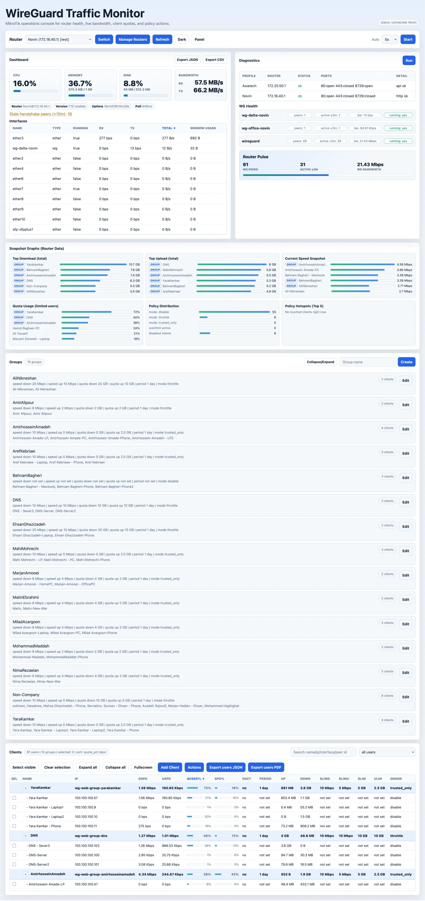

# MikroTik WireGuard Manager

Web panel for managing MikroTik RouterOS WireGuard clients, traffic policies, shared group limits, and operational health.

The application is a management and monitoring panel. Router-side enforcement stays on RouterOS through firewall, queue, address-list, and scheduler rules. The web process can be stopped without removing active RouterOS policies.



## Features

- Multi-router profile management with optional session-only credentials.
- Dashboard for CPU, memory, disk, bandwidth, interface usage, alerts, diagnostics, and WireGuard health.
- Live browser updates through Server-Sent Events without refreshing the page.
- Client management: add, enable, disable, delete, revoke, reset usage, speed limits, quota policies, and export.
- Group management: one user per group, shared speed/quota policies, RouterOS address lists, group usage graphs, and member management.
- Grouped client table with sortable columns, draggable/resizable columns, collapse/expand groups, filters, and in-page fullscreen mode.
- Panel settings persisted in `.wg_web_state.json`: theme, visible sections, sort columns, filters, auto-refresh interval, column order/widths, and collapse state.
- JSON/PDF exports that include both users and groups.
- Docker Compose and local runner script.

## Requirements

- Python 3.10+
- MikroTik RouterOS v7
- RouterOS REST or API access from the machine running this panel
- `wg` command for local WireGuard key generation when adding/revoking clients
- Docker, only if using Docker mode

## Quick Start

Local mode:

```bash
./run.sh
```

Docker mode:

```bash
./run.sh docker
```

The panel opens at `http://127.0.0.1:8088` by default.

Manual run:

```bash
python3 -m venv .venv
source .venv/bin/activate
pip install -r requirements-web.txt
uvicorn main:app --host 0.0.0.0 --port 8088
```

## Docker Compose

```bash
docker compose up -d --build
```

The compose file mounts:

- `./.env` to `/app/.env` as read-only configuration.
- A named `wg-web-data` volume to `/app/data` for panel state.

Set a custom port with:

```bash
WG_WEB_PORT=8090 ./run.sh docker
```

## Configuration

Create `.env` with router profiles:

```env
Novin_Max={ user=YOUR_USER, password=CHANGE_ME, router_ip=172.16.40.1, endpoint_ip=YOUR_PUBLIC_IP, dns_servers=100.100.100.100,100.100.100.101, transport=rest, use_https=false, timeout_sec=30, exempt_traffic_dst_list=quota_exempt }
Office_Max={ user=YOUR_USER, password=CHANGE_ME, router_ip=192.168.10.1, endpoint_ip=YOUR_PUBLIC_IP, dns_servers=100.100.100.100,100.100.100.101, transport=rest, use_https=false, timeout_sec=30, exempt_traffic_dst_list=quota_exempt }
DEFAULT_ROUTER_PROFILE=Novin_Max
```

Profile fields:

- `user`: RouterOS username.
- `password`: RouterOS password.
- `router_ip`: router address reachable from this panel.
- `endpoint_ip`: public endpoint used in generated WireGuard configs.
- `dns_servers`: DNS values written into generated client configs.
- `transport`: `rest`, `api_ssl`, or `api`.
- `use_https`: `true` or `false` for REST.
- `timeout_sec`: RouterOS request timeout.
- `exempt_traffic_dst_list`: RouterOS address list excluded from quota accounting.

Optional paths:

```env
WG_WEB_ENV_FILE=.env
WG_WEB_STATE_FILE=.wg_web_state.json
```

## Panel Settings

Panel preferences are stored in the web state file, usually `.wg_web_state.json`.

Persisted settings include:

- Theme: light or dark.
- Auto-refresh interval.
- Client table filter.
- Client and interface sort columns/direction.
- Client column order and widths.
- Collapsed/expanded client groups.
- Collapsed/expanded Groups panel.
- Visible/hidden dashboard sections.

Use the `Panel` menu in the top bar to hide or show:

- Dashboard
- Diagnostics
- WG Health
- Snapshot Graphs
- Groups
- Clients

## Groups

Groups are scoped per router profile. A client can belong to only one group, and clients with individual speed/quota policies cannot be added to a group. Group limits are enforced on RouterOS using address lists, mangle rules, queue trees, filters, and schedulers.

Deleting a group does not delete clients from the router. It removes group rules and returns members to normal users without group limits.

## Exports

User exports now include:

- Router/profile metadata
- Users
- Groups
- Group members
- Effective group policy/speed context

Endpoints:

- `/api/exports/users.json`
- `/api/exports/users.pdf`
- `/api/exports/dashboard.json`
- `/api/exports/dashboard.csv`

## Project Layout

- `main.py`: FastAPI entrypoint for `uvicorn main:app`.
- `src/wg_users_web/api/`: API routes and app factory.
- `src/wg_users_web/engine.py`: RouterOS management engine.
- `src/wg_users_web/routeros.py`: RouterOS REST/API clients.
- `src/wg_users_web/services/`: profile, group, client, router-data, export, and settings services.
- `src/wg_users_web/web_static/`: frontend HTML/CSS/JS.
- `tests/`: unit tests.
- `run.sh`: local/Docker launcher.
- `docker-compose.yml`: Docker Compose deployment.

## Verification

```bash
for f in src/wg_users_web/web_static/*.js; do node --check "$f"; done
python3 -m py_compile $(find src/wg_users_web -name '*.py' -print) main.py
ruff check src tests main.py
PYTHONPATH=src python3 -m unittest discover -s tests
```

## License

MIT License. See `LICENSE`.
